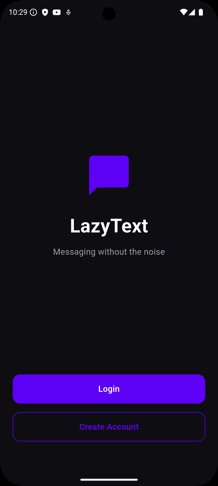
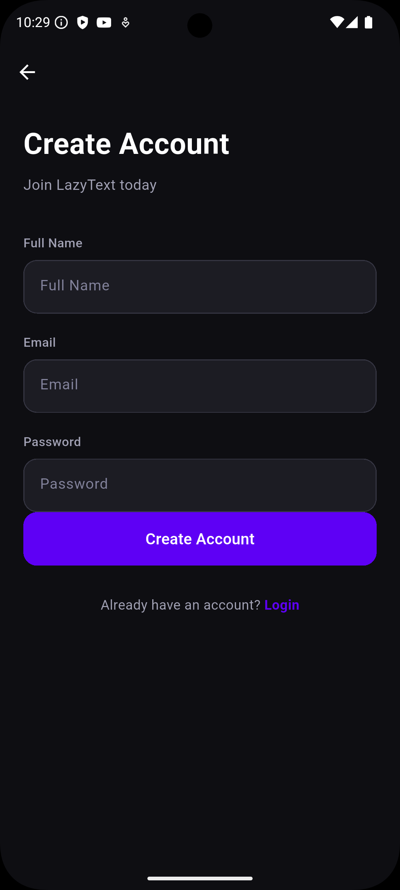
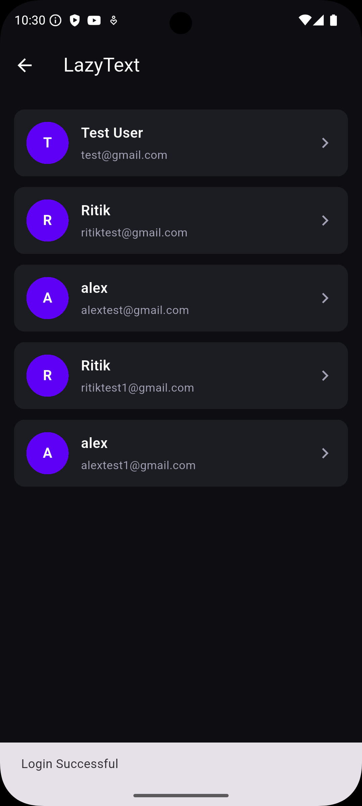
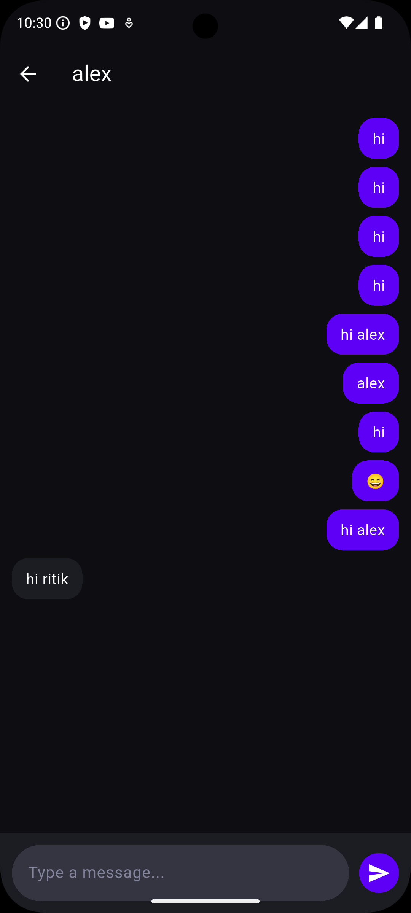

# 🚀 LazyText

A modern real-time messaging application built with **Flutter**, **Node.js**, **Express**, **MongoDB**, and **Socket.IO**.

LazyText enables users to authenticate securely, discover other users, and exchange messages instantly through WebSocket-powered communication.

---

## 📱 Screenshots

### Welcome Screen



### Create Account



### Users List



### Chat Interface


### Real-Time Messaging



---

## ✨ Features

### 🔐 Authentication

* User Registration
* User Login
* JWT Authentication
* Protected API Routes
* Password Hashing using BCrypt

### 💬 Real-Time Messaging

* One-to-One Chat
* Socket.IO Integration
* Instant Message Delivery
* Persistent Chat History
* Real-Time Synchronization

### 👥 User Management

* Browse Registered Users
* User Discovery Screen
* Secure User Sessions

### 🎨 Modern UI

* Dark Theme Design
* Responsive Layout
* Reusable Flutter Widgets
* Modern Chat Bubbles
* Smooth Navigation

---

## 🛠 Tech Stack

### Frontend

* Flutter
* Dart
* Dio
* Shared Preferences
* Socket.IO Client

### Backend

* Node.js
* Express.js
* Socket.IO
* JWT Authentication
* BCryptJS

### Database

* MongoDB
* Mongoose

### Cloud Services

* Cloudinary

---

## 🏗️ Architecture

```text
Flutter App
     │
     ▼
 REST API (Dio)
     │
     ▼
Express Backend
     │
     ▼
MongoDB

Flutter App
     │
     ▼
Socket.IO Client
     │
     ▼
Socket.IO Server
     │
     ▼
Real-Time Communication
```

---

## 📂 Project Structure

```text
lib/
│
├── common/
│   └── color_extension.dart
│
├── models/
│   └── user_model.dart
│
├── screens/
│   ├── auth/
│   ├── chat/
│   └── home/
│
├── services/
│   ├── api_service.dart
│   └── socket_service.dart
│
├── widgets/
│   ├── custom_button.dart
│   ├── message_bubble.dart
│   ├── message_input.dart
│   ├── round_textfield.dart
│   └── user_tile.dart
│
└── main.dart
```

---

## 🔐 Authentication Flow

```text
User Signup/Login
        │
        ▼
Backend Validation
        │
        ▼
JWT Generation
        │
        ▼
SharedPreferences
        │
        ▼
Protected API Access
```

---

## ⚡ Real-Time Messaging Flow

```text
User A Sends Message
         │
         ▼
Socket.IO Server
         │
         ▼
MongoDB Storage
         │
         ▼
Receiver Socket
         │
         ▼
User B Receives Instantly
```

---

## 📡 REST API Endpoints

### Authentication

```http
POST /api/auth/signup
POST /api/auth/login
POST /api/auth/logout
GET  /api/auth/check
```

### Messaging

```http
GET  /api/message/users
GET  /api/message/:userId
POST /api/message/send/:receiverId
```

---

## 🔌 Socket Events

### Client → Server

```text
connection
disconnect
```

### Server → Client

```text
newMessage
onlineUsers
```

---

## ⚙️ Environment Variables

Create a `.env` file inside the backend folder:

```env
PORT=5001

MONGODB_URI=your_mongodb_uri

JWT_SECRET=your_secret_key

CLOUDINARY_CLOUD_NAME=your_cloud_name

CLOUDINARY_API_KEY=your_api_key

CLOUDINARY_API_SECRET=your_api_secret
```

---

## 🚀 Installation

### Backend Setup

```bash
git clone https://github.com/yourusername/lazytext.git

cd backend

npm install

npm run dev
```

### Flutter Setup

```bash
cd lazy_text

flutter pub get

flutter run
```

---

## 🎯 Key Learning Outcomes

This project helped me gain hands-on experience with:

* Flutter Application Development
* REST API Integration
* JWT Authentication
* MongoDB Data Modeling
* Socket.IO Real-Time Communication
* Backend Development with Express.js
* Secure Authentication Flows
* Full-Stack Application Architecture

---

## 🔮 Future Improvements

* Online / Offline Presence
* Typing Indicators
* Read Receipts
* Image Messaging
* Push Notifications
* Group Chats
* Voice Messages
* Message Search
* End-to-End Encryption

---

## 📈 Resume Highlights

This project demonstrates:

✅ Full-Stack Development

✅ Mobile App Development

✅ REST API Design

✅ Authentication & Authorization

✅ MongoDB Database Design

✅ WebSocket Communication

✅ Real-Time Systems

✅ Production-Oriented Architecture

---
### Project Title for Resume

**LazyText – Real-Time Chat Application (Flutter, Node.js, MongoDB, Socket.IO)**
